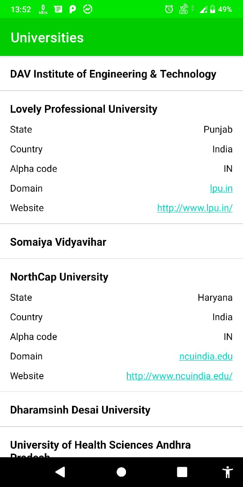
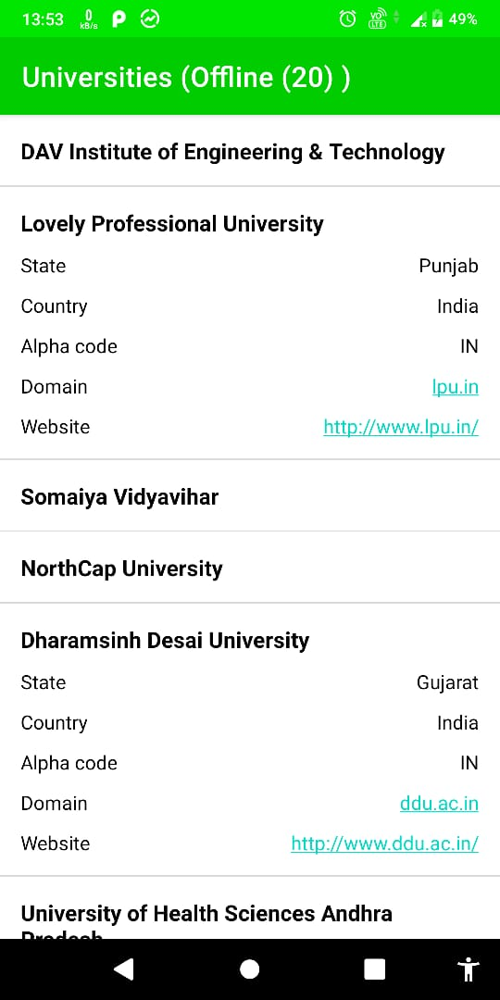
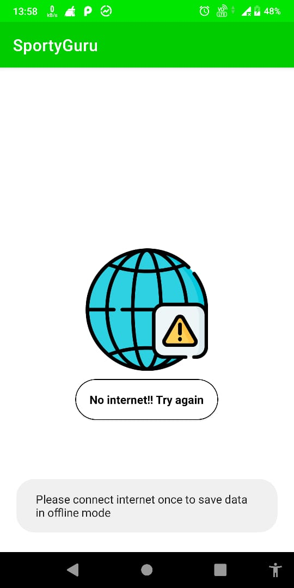

# SportyGuru =>  this app loads image from api given in task and stores 20 universities data in room database. when app is offline it shows suitable message and load data from room database if data is stored in room database. i have used 3rd party library to check the internet connectivity in app. This app only populates the data, however i have written query for delete in DAO interface but it is not used as it was mentioned in task that data should be cleared from room database. If judges feel delete is also needed then please instruct me and i will make the changes.

 

